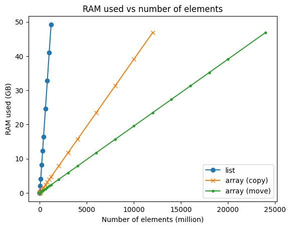
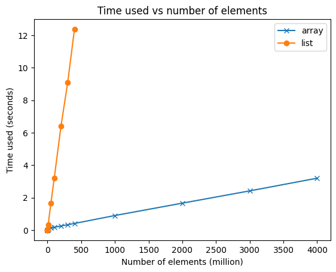

# pybind11-numpy-example

# What

A simple example of how to use [pybind11](https://github.com/pybind/pybind11) with [numpy](https://numpy.org/).

This C++/Python library creates a `std::vector` of 16-bit ints,
and exposes it either as a Python List or as a NumPy array.

# Why

Python Lists are great!
However, for the specific use case of storing many small elements of the same type,
a Numpy array is faster and uses a lot less memory:

[scripts/memory.png]

# How

See [python/pybind11-numpy-example_python.cpp](python/pybind11-numpy-example_python.cpp) for how to do this in C++ using pybind11.

The scripts used to generate the above plots are in [scripts](scripts) 

This repo was quickly set up using the SSC [C++ Project Cookiecutter](https://github.com/ssciwr/cookiecutter-cpp-project)